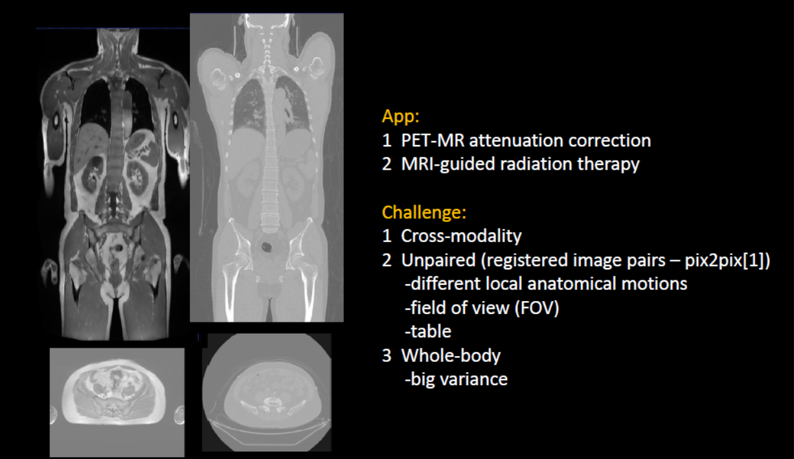
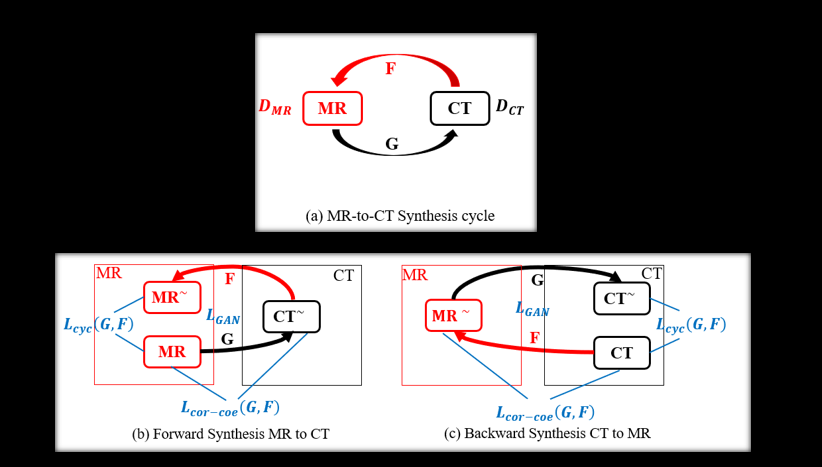
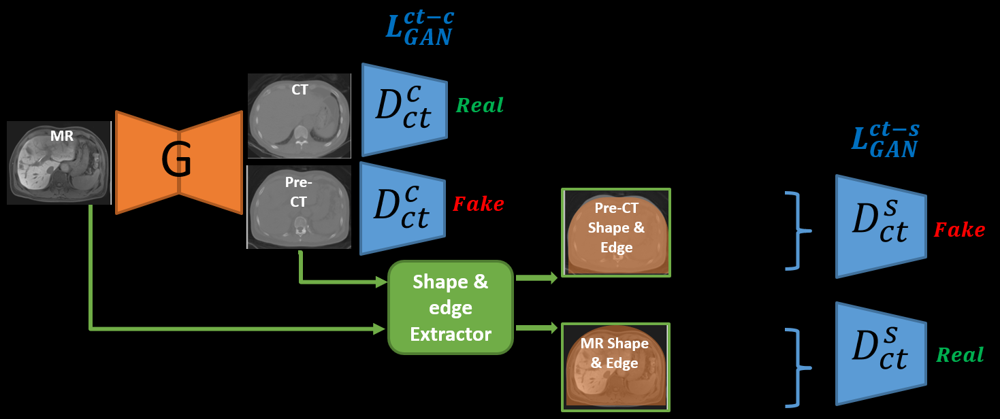
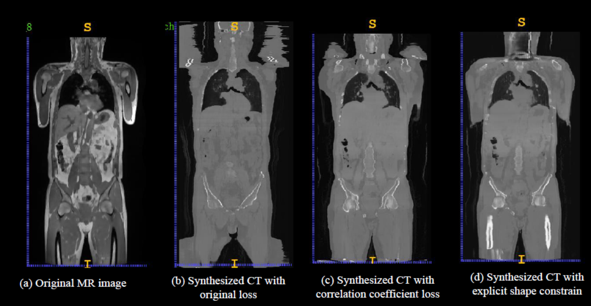
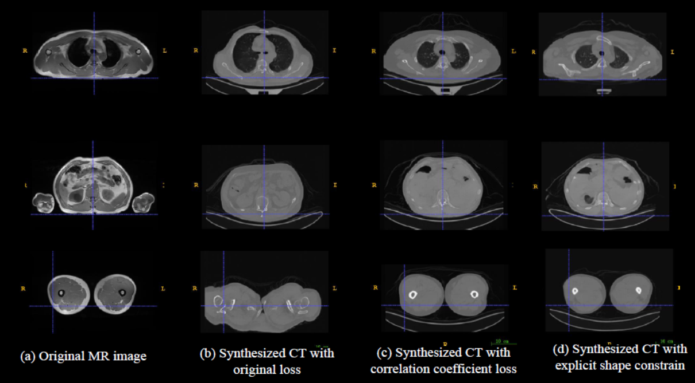

# Unpaired-Cross-modality-Image-Synthesis

This is our PyTorch implementation for Unpaired whole-body MR to CT Image Synthesis. It is still under active development.

The code was written by [Yunhao Ge](https://github.com/gyhandy) based on the structure of Cycle-GAN ([Jun-Yan Zhu](https://github.com/junyanz)).

**Unpaired Whole-body MR to CT Synthesis with Correlation Coefficient Constrained Adversarial Learning: [PDF](https://github.com/gyhandy/publication/raw/master/Unpaired%20whole-body%20MR%20to%20CT%20synthesis%20with%20correlation%20coefficient%20constrained%20adversarial%20learning-SPIE.pdf) 

## Abstract

MR to CT image synthesis plays an important role in medical image analysis, and its applications included, but not limited to PET-MR attenuation correction and MR only radiation therapy planning.Recently, deep learning-based image synthesis techniques have achieved much success. However, most of the current methods require large scales of paired data from two different modalities, which greatly limits their usage as in some situation paired data is infeasible to obtain. Some efforts have been proposed to relax this constraint such as cycle-consistent adversarial networks (Cycle-GAN). However, the cycle consistency loss is an indirect structural similarity constraint of input and synthesized images, and it sometimes lead to inferior synthesized results.  
Contribution  
1 Proposed an explicit structural constrained adversarial learning method to improve both the realistic and precise of the synthesized images which were unique to cross-modality medical image mapping  
2 Designed a novel correlation coefficient loss, which directly constrained the structural similarity between the input Magnetic Resonance (MR) and synthesized Computed Tomography (CT) image, to solve the mismatch of anatomical structures in synthesized CT images  
3 Developed a shape discriminator to incorporate the shape consistency information by extracting shape masks from two modality images
to improve the synthesis quality. Gained substantial quality improvement especially in the surface shape and bone in whole body image
mapping  

#### original_data

#### pipeline



#### performance





## Code description

### data_processing

Before classification and regression, process the raw data 

- only augment top train data，`data_augment_top.py`
- augment train data，`data_augment_all.py`
- onehot coding，`onehot.py`
- make offline dataset，`offline_data_extract.py`

#### original_data

- upload sample，`d_sample_20180102.csv`
- testdata_A，`d_test_A_20180102`
- testdata_B，`d_test_B_20180128.csv`

#### aug_data

- augmented data，`d_top_augment_5times_2.csv`
- augmented data，`d_top_20180201_130642.csv`
- augmented data，`d_top.csv`

#### final_onehot

After one hot coding waiting for being used

- train data，`all_train_feat.csv`
- test data A without label，`all_test_feat_A.csv`
- test data A with label，`all_test_feat_A_withlabel.csv`
- test data B without label，`all_test_feat_B.csv`
- augmented train data，`arg_top_.csv`
- train data - offline test，`offline_train_feat.csv`
- offline data to imitate A/B test，`offline_test_feat.csv`

### regression

Elastic linear regression

- Elastic linear regression，`elasticnet_regression.py`
- normalize function，`normalize.py`

#### output

- output of regression，`pre_results.csv`
- saved regression model，`linear_regression_modelNor.h5`


### classification

- `cla_rf.py`，training random forest classification (threhold of blood suger is top n% Median)
- `cla_xgb_hp95.py`，training XGboost classification (threhold of blood suger is top 95% Median)
- `cla_xgb_lp30.py`,training XGboost classification (threhold of blood suger is low 30% Median)
- `cla_svm.py`,training SVM classification (threhold of blood suger is top n% Median)
- `voting.py`,soft vote to get classification top-k result by combining different classifications
- `hard_voting.py`,hard vote to get classification top-k result (not good)
- `W.py`,training weight to combine different classification (hard to train)
- `W_simple.py`,training weight to combine different classification

#### output

output of single classification

##### deep_w

output of single classification to train W_simple

#### final_top_cla

##### offline
final result of combining classification to get the highest bloos suger with label (offline)

##### online
final result of combining classification to get the highest bloos suger without label (online)


## Getting Started
### Installation
- Install PyTorch 0.4, torchvision, and other dependencies from http://pytorch.org
- Install python libraries [visdom](https://github.com/facebookresearch/visdom) and [dominate](https://github.com/Knio/dominate).
```bash
pip install visdom dominate
```
- Alternatively, all dependencies can be installed by
```bash
pip install -r requirements.txt
```
- Clone this repo:
```bash
git clone https://github.com/junyanz/pytorch-CycleGAN-and-pix2pix
cd pytorch-CycleGAN-and-pix2pix
```
- For Conda users, we include a script `./scripts/conda_deps.sh` to install PyTorch and other libraries.

### CycleGAN train/test
- Download a CycleGAN dataset (e.g. maps):
```bash
bash ./datasets/download_cyclegan_dataset.sh maps
```
- Train a model:
```bash
#!./scripts/train_cyclegan.sh
python train.py --dataroot ./datasets/maps --name maps_cyclegan --model cycle_gan
```
- To view training results and loss plots, run `python -m visdom.server` and click the URL http://localhost:8097. To see more intermediate results, check out `./checkpoints/maps_cyclegan/web/index.html`
- Test the model:
```bash
#!./scripts/test_cyclegan.sh
python test.py --dataroot ./datasets/maps --name maps_cyclegan --model cycle_gan
```
The test results will be saved to a html file here: `./results/maps_cyclegan/latest_test/index.html`.

### pix2pix train/test
- Download a pix2pix dataset (e.g.facades):
```bash
bash ./datasets/download_pix2pix_dataset.sh facades
```
- Train a model:
```bash
#!./scripts/train_pix2pix.sh
python train.py --dataroot ./datasets/facades --name facades_pix2pix --model pix2pix --which_direction BtoA
```
- To view training results and loss plots, run `python -m visdom.server` and click the URL http://localhost:8097. To see more intermediate results, check out  `./checkpoints/facades_pix2pix/web/index.html`
- Test the model (`bash ./scripts/test_pix2pix.sh`):
```bash
#!./scripts/test_pix2pix.sh
python test.py --dataroot ./datasets/facades --name facades_pix2pix --model pix2pix --which_direction BtoA
```
The test results will be saved to a html file here: `./results/facades_pix2pix/test_latest/index.html`.

More example scripts can be found at `scripts` directory.

### Apply a pre-trained model (CycleGAN)
- You can download a pretrained model (e.g. horse2zebra) with the following script:
```bash
bash ./scripts/download_cyclegan_model.sh horse2zebra
```
The pretrained model is saved at `./checkpoints/{name}_pretrained/latest_net_G.pth`. The available models are apple2orange, orange2apple, summer2winter_yosemite, winter2summer_yosemite, horse2zebra, zebra2horse, monet2photo, style_monet, style_cezanne, style_ukiyoe, style_vangogh, sat2map, map2sat, cityscapes_photo2label, cityscapes_label2photo, facades_photo2label, facades_label2photo, and iphone2dslr_flower.
- To test the model, you also need to download the  horse2zebra dataset:
```bash
bash ./datasets/download_cyclegan_dataset.sh horse2zebra
```

- Then generate the results using
```bash
python test.py --dataroot datasets/horse2zebra/testA --name horse2zebra_pretrained --model test
```
The option `--model test` is used for generating results of CycleGAN only for one side. `python test.py --model cycle_gan` will require loading and generating results in both directions, which is sometimes unnecessary. The results will be saved at `./results/`. Use `--results_dir {directory_path_to_save_result}` to specify the results directory.

- If you would like to apply a pre-trained model to a collection of input images (rather than image pairs), please use `--dataset_mode single` and `--model test` options. Here is a script to apply a model to Facade label maps (stored in the directory `facades/testB`).
``` bash
#!./scripts/test_single.sh
python test.py --dataroot ./datasets/facades/testB/ --name {your_trained_model_name} --model test
```
You might want to specify `--which_model_netG` to match the generator architecture of the trained model.

### Apply a pre-trained model (pix2pix)

Download a pre-trained model with `./scripts/download_pix2pix_model.sh`.

- For example, if you would like to download label2photo model on the Facades dataset,
```bash
bash ./scripts/download_pix2pix_model.sh facades_label2photo
```

- Download the pix2pix facades datasets
```bash
bash ./datasets/download_pix2pix_dataset.sh facades
```
- Then generate the results using
```bash
python test.py --dataroot ./datasets/facades/ --which_direction BtoA --model pix2pix --name facades_label2photo_pretrained
```
Note that we specified `--which_direction BtoA` as Facades dataset's A to B direction is photos to labels.

- See a list of currently available models at `./scripts/download_pix2pix_model.sh`

## [Datasets](docs/datasets.md)
Download pix2pix/CycleGAN datasets and create your own datasets.

## [Training/Test Tips](docs/tips.md)
Best practice for training and testing your models.

## cite

Unpaired Image-to-Image Translation using Cycle-Consistent Adversarial Networks
[Jun-Yan Zhu](https://people.eecs.berkeley.edu/~junyanz/)\*,  [Taesung Park](https://taesung.me/)\*, [Phillip Isola](https://people.eecs.berkeley.edu/~isola/), [Alexei A. Efros](https://people.eecs.berkeley.edu/~efros)
In ICCV 2017. (* equal contributions) [[Bibtex]](https://junyanz.github.io/CycleGAN/CycleGAN.txt)


